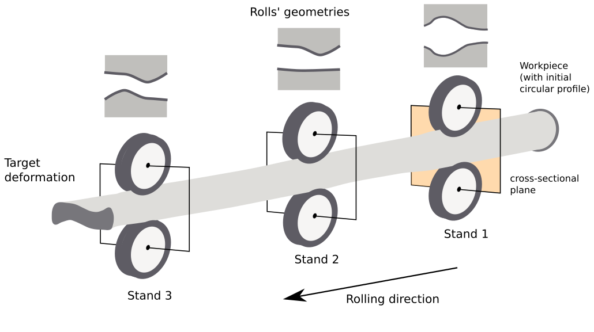
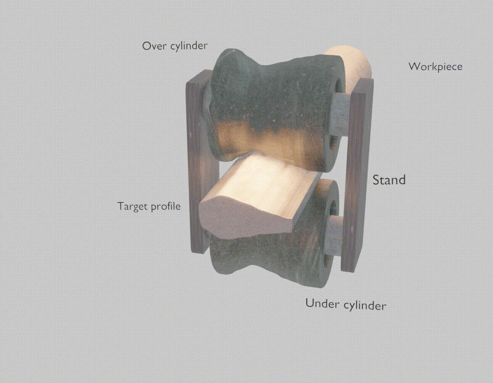
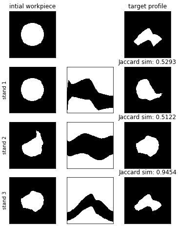

# Additional information for Learning to predict metal deformations in hot-rolling processes submission

> This work was supported by INNOSUISSE under the project application number 33968.1 IP-ENG

> **Generated data can only be provided on-request.**

## Hot-rolling process for single-stand configurations

Hot rolling is a metal forming process that produces a workpiece with a desired target cross-section from an input workpiece through a sequence of plastic deformations; each deformation is applied by a stand with a set of rolls with a specific geometry. In current practice, the sequence of stands and the geometry of their rolls (rolling sequence) needed to achieve a given final cross-section is designed by experts based on previous experience, and iteratively refined in a costly trial-and-error process. Finite Element Method simulations are increasingly adopted to make this process more efficient and to test potential rolling sequences, achieving good accuracy at the cost of long simulation times, which limits the practical use of the approach.  In this paper, we propose a supervised learning approach to predict the deformation of a workpiece by a set of rolls with a given geometry. Compared to reference FEM simulations, we achieve an accuracy of $.97$, with a 30000-fold reduction in computational time. 

**Single-stand scenario**

### Examples of deformation estimation results

### Examples of planning results

