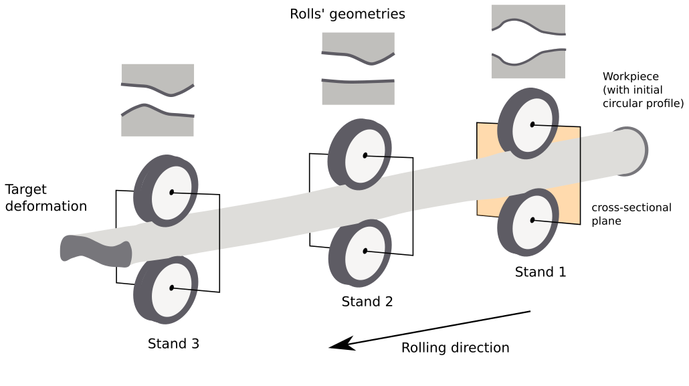
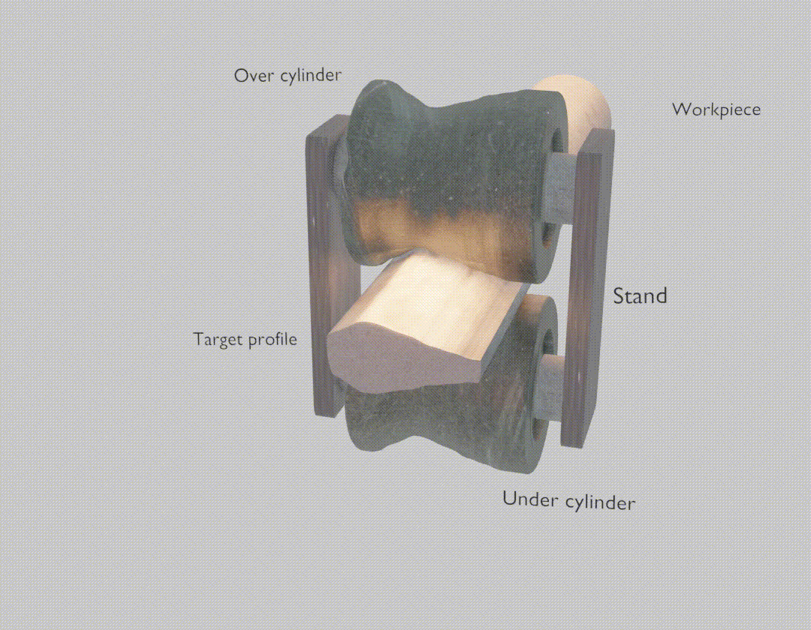
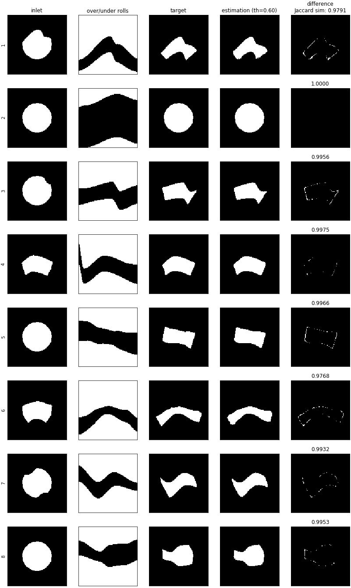
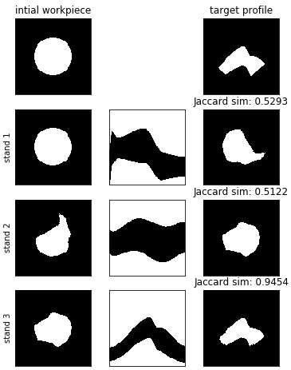

# Learning to predict metal deformations in hot-rolling processes submission

> This work was supported by INNOSUISSE under the project application number 33968.1 IP-ENG

> **Generated data can only be provided on-request.**

## Hot-rolling process for single-stand configurations

Hot-rolling is a metal forming process that produces a workpiece with a desired target cross-section from an input workpiece through a sequence of plastic deformations; each deformation is generated by a stand composed of opposing rolls with a specific geometry. In current practice, the rolling sequence (i.e., the sequence of stands and the geometry of their rolls) needed to achieve a given final cross-section is designed by experts based on previous experience, and iteratively refined in a costly trial-and-error process. Finite Element Method simulations are increasingly adopted to make this process more efficient and to test potential rolling sequences, achieving good accuracy at the cost of long simulation times, limiting the practical use of the approach. We propose a supervised learning approach to predict the deformation of a given workpiece by a set of rolls with a given geometry; the model is trained on a large dataset of procedurally-generated FEM simulations, which we publish as supplementary material. The resulting predictor is four orders of magnitude faster than simulations, and yields an average Jaccard Similarity Index of *0.972* (against ground truth from simulations) and *0.925* (against real-world measured deformations); we additionally report preliminary results on using the predictor for automatic planning of rolling sequences.

**Single-stand scenario**

### Examples of deformation estimation results

### Examples of planning results

